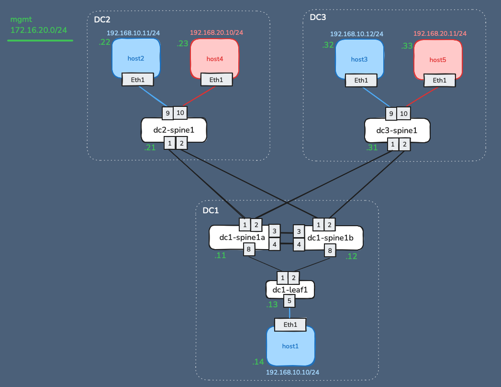

# VXLAN HER Topology with Containerlab

<h4 align="center">Let's use containerlab to bootstrap a VXLAN infrastructure with Arista cEOS</h4>

<p align="center">
<a href="https://github.com/vttrj/lab1-vxlan-her/issues"></a>
<a href="https://jvetter.net"></a>
</a>
</p>

<p align="center">
  <a href="#design-principles">Design principles</a> •
  <a href="#installation">Installation</a> •
  <a href="#usage">Usage</a> •
  <a href="#-resources">Resources</a>
</p>


---
# Design principles


This topology represents a Data Center Interconnect (DCI) infrastructure. On this IP Fabric, the underlay network uses OSPF, and VXLAN (RFC 7348) serves as the overlay technology to extend Layer 2 connectivity between data centers. The signaling method is called Head-end-replication (HER), also called ingress replication, meaning MAC address is learnt during the flood and learn process.

In DC1, both spines are configured in an MLAG setup with a shared VTEP. 
On each spine, VLAN 10 and VLAN 20 are configured with an anycasted SVI, ensuring the same default gateway for connected hosts, regardless of their data center location.

For an in-depth explanation, see the related article: 

# Installation
## Requirements
- OS: Linux
- CPUs: 4
- Memory: 16GB

## Prerequisites
Containerlab and Docker can be installed from this script:
```sh
$ curl -sL https://containerlab.dev/setup | sudo -E bash -s "all"
```

## Import docker images
Two Docker images are required to run this lab.

The network devices use Arista cEOS (container version of EOS). To download it:
1. Login to Arista portal (create an account if you don't have one) and go to <a href="https://www.arista.com/en/support/software-download">software downloads </a>
2. Select `EOS > cEOS Lab > 4.32 > EOS-4.32.0.1F`
3. Download `cEOS64-lab-4.32.0.1F.tar.xz`
4. Upload the image to the host that will run the lab 
5. Then use `docker import` to add it to make this image available for docker

```sh
$ docker import cEOS64-lab-4.32.0.1F.tar.xz ceos:4.32.0.1F
```
The hosts in this lab use an Alpine Linux image, pre-packaged with useful network tools such as tcpdump and traceroute.
```sh
$ docker pull wbitt/network-multitool
```

Then, confirm both images are imported:
```sh
$ docker image ls
REPOSITORY                     TAG         IMAGE ID       CREATED         SIZE
ceos                           4.32.0.1F   9b350f130c9d   10 days ago     2.4GB
wbitt/network-multitool        latest      713337546be6   15 months ago   75.9MB
```

## Deploy the topology
First, clone the current repository:
```sh
$ git clone https://github.com/vttrj/lab1-vxlan-her.git
```
Next, deploy the lab using Containerlab:

```sh
$ cd lab1-vxlan-her
$ sudo containerlab deploy -t vxlanher.clab.yml
```

The lab should be deployed within 1-3 minutes:
```console
INFO[0066] Adding containerlab host entries to /etc/hosts file
INFO[0066] Adding ssh config for containerlab nodes
INFO[0066] 🎉 New containerlab version 0.60.1 is available! Release notes: https://containerlab.dev/rn/0.60/#0601
Run 'containerlab version upgrade' to upgrade or go check other installation options at https://containerlab.dev/install/
+----+----------------------------+--------------+--------------------------------+-------+---------+-----------------+--------------+
| #  |            Name            | Container ID |             Image              | Kind  |  State  |  IPv4 Address   | IPv6 Address |
+----+----------------------------+--------------+--------------------------------+-------+---------+-----------------+--------------+
|  1 | clab-vxlan-her-dc1-leaf1   | c4b28cab9d89 | ceos:4.32.0.1F                 | ceos  | running | 172.16.20.13/24 | N/A          |
|  2 | clab-vxlan-her-dc1-spine1a | 027ada636cc0 | ceos:4.32.0.1F                 | ceos  | running | 172.16.20.11/24 | N/A          |
|  3 | clab-vxlan-her-dc1-spine1b | 31daeed99c15 | ceos:4.32.0.1F                 | ceos  | running | 172.16.20.12/24 | N/A          |
|  4 | clab-vxlan-her-dc2-spine1  | 897b2a3351c1 | ceos:4.32.0.1F                 | ceos  | running | 172.16.20.21/24 | N/A          |
|  5 | clab-vxlan-her-dc3-spine1  | bbcd632c004f | ceos:4.32.0.1F                 | ceos  | running | 172.16.20.31/24 | N/A          |
|  6 | clab-vxlan-her-host1       | eb81be467a3e | wbitt/network-multitool:latest | linux | running | 172.16.20.14/24 | N/A          |
|  7 | clab-vxlan-her-host2       | 9f4ca3dfa960 | wbitt/network-multitool:latest | linux | running | 172.16.20.22/24 | N/A          |
|  8 | clab-vxlan-her-host3       | f56f8d73b08a | wbitt/network-multitool:latest | linux | running | 172.16.20.32/24 | N/A          |
|  9 | clab-vxlan-her-host4       | 348c2974f6bf | wbitt/network-multitool:latest | linux | running | 172.16.20.23/24 | N/A          |
| 10 | clab-vxlan-her-host5       | 9a53d28edf70 | wbitt/network-multitool:latest | linux | running | 172.16.20.33/24 | N/A          |
+----+----------------------------+--------------+--------------------------------+-------+---------+-----------------+--------------+
```

Once deployed, a new folder is created, named clab-"name of the lab in the topology file", so in this case the folder is `clab-vxlan-her`:
```sh
$ ll
total 16
drwxr-xr-x  2 debian debian 4096 Dec 29 21:05 bootstrap-config
drwxrwxr-x+ 8 root   root   4096 Dec 29 23:09 clab-vxlan-her
-rw-r--r--  1 debian debian 2558 Dec 29 23:09 vxlanher.clab.yml

$ ll clab-vxlan-her/
total 68
-rw-rw-r--+ 1 root root  1155 Dec 29 23:10 ansible-inventory.yml
-rw-r--r--+ 1 root root  1187 Dec 29 23:09 authorized_keys
drwxrwxr-x+ 3 root root  4096 Dec 29 23:09 dc1-leaf1
drwxrwxr-x+ 3 root root  4096 Dec 29 23:09 dc1-spine1a
drwxrwxr-x+ 3 root root  4096 Dec 29 23:09 dc1-spine1b
drwxrwxr-x+ 3 root root  4096 Dec 29 23:09 dc2-spine1
drwxrwxr-x+ 3 root root  4096 Dec 29 23:09 dc3-spine1
-rw-rw-r--+ 1 root root 16583 Dec 29 23:10 topology-data.json
```

In this folder:
- An automatically generated `ansible-inventory.yml` file is created, to facilitate ansible usage for these hosts
- An automatically generated `authorized_keys` file containing your SSH public keys, allowing you to import it into the `~/.ssh/` directory for SSH key-based authentication
- A dedicated folder for each network node, which stores the flash memory contents, including the startup configuration
```sh
$ ll clab-vxlan-her/dc1-leaf1/flash/
total 84
drwxrwxr-x+ 3 root root 4096 Dec 29 23:09 aboot
-rw-rw-r--+ 1 root root  231 Dec 29 23:09 AsuFastPktTransmit.log
-rw-rw-r--+ 1 root root    0 Dec 29 23:10 boot-config
drwxrwx---+ 3 root root 4096 Dec 29 23:20 debug
drwxrwxr-x+ 2 root root 4096 Dec 29 23:09 fastpkttx.backup
drwxrwxr-x+ 2 root root 4096 Dec 29 23:09 Fossil
-rwxrwxrwx+ 1 root root  440 Dec 29 23:09 if-wait.sh
-rw-rw-r--+ 1 root root  161 Dec 29 23:09 kickstart-config
drwxrwxr-x+ 3 root root 4096 Dec 30 00:45 persist
drwxrwxr-x+ 3 root root 4096 Dec 29 23:10 schedule
-rw-rw-r--+ 1 root root  142 Dec 29 23:09 SsuRestoreLegacy.log
-rw-rw-r--+ 1 root root  142 Dec 29 23:09 SsuRestore.log
-rw-rw-r--+ 1 root root 1359 Dec 29 23:10 startup-config
-rw-rwxr--+ 1 root root   18 Dec 29 23:09 system_mac_address
drwxrwxr-x+ 2 root root 4096 Dec 29 23:09 tpm-data
```


# Usage
## Checks
Anytime you can check the lab you've deployed, run the following command where the topology .yml file is present:
```sh
$ sudo clab inspect
INFO[0000] Parsing & checking topology file: vxlanher.clab.yml
+----+----------------------------+--------------+--------------------------------+-------+---------+-----------------+--------------+
| #  |            Name            | Container ID |             Image              | Kind  |  State  |  IPv4 Address   | IPv6 Address |
+----+----------------------------+--------------+--------------------------------+-------+---------+-----------------+--------------+
|  1 | clab-vxlan-her-dc1-leaf1   | c4b28cab9d89 | ceos:4.32.0.1F                 | ceos  | running | 172.16.20.13/24 | N/A          |
|  2 | clab-vxlan-her-dc1-spine1a | 027ada636cc0 | ceos:4.32.0.1F                 | ceos  | running | 172.16.20.11/24 | N/A          |
|  3 | clab-vxlan-her-dc1-spine1b | 31daeed99c15 | ceos:4.32.0.1F                 | ceos  | running | 172.16.20.12/24 | N/A          |
|  4 | clab-vxlan-her-dc2-spine1  | 897b2a3351c1 | ceos:4.32.0.1F                 | ceos  | running | 172.16.20.21/24 | N/A          |
|  5 | clab-vxlan-her-dc3-spine1  | bbcd632c004f | ceos:4.32.0.1F                 | ceos  | running | 172.16.20.31/24 | N/A          |
|  6 | clab-vxlan-her-host1       | eb81be467a3e | wbitt/network-multitool:latest | linux | running | 172.16.20.14/24 | N/A          |
|  7 | clab-vxlan-her-host2       | 9f4ca3dfa960 | wbitt/network-multitool:latest | linux | running | 172.16.20.22/24 | N/A          |
|  8 | clab-vxlan-her-host3       | f56f8d73b08a | wbitt/network-multitool:latest | linux | running | 172.16.20.32/24 | N/A          |
|  9 | clab-vxlan-her-host4       | 348c2974f6bf | wbitt/network-multitool:latest | linux | running | 172.16.20.23/24 | N/A          |
| 10 | clab-vxlan-her-host5       | 9a53d28edf70 | wbitt/network-multitool:latest | linux | running | 172.16.20.33/24 | N/A          |
+----+----------------------------+--------------+--------------------------------+-------+---------+-----------------+--------------+
```

Containerlab creates corresponding entries for every deployed nodes in /etc/hosts, facilitating their access:
```sh
$ cat /etc/hosts
...
###### CLAB-vxlan-her-START ######
172.16.20.22    clab-vxlan-her-host2
172.16.20.33    clab-vxlan-her-host5
172.16.20.11    clab-vxlan-her-dc1-spine1a
172.16.20.12    clab-vxlan-her-dc1-spine1b
172.16.20.21    clab-vxlan-her-dc2-spine1
172.16.20.31    clab-vxlan-her-dc3-spine1
172.16.20.13    clab-vxlan-her-dc1-leaf1
172.16.20.14    clab-vxlan-her-host1
172.16.20.32    clab-vxlan-her-host3
172.16.20.23    clab-vxlan-her-host4
###### CLAB-vxlan-her-END ######
```

You can list containers currently running with docker command:
```sh
$ docker container ls
CONTAINER ID   IMAGE                            COMMAND                  CREATED          STATUS          PORTS                                  NAMES
31daeed99c15   ceos:4.32.0.1F                   "bash -c '/mnt/flash…"   48 minutes ago   Up 48 minutes                                          clab-vxlan-her-dc1-spine1b
9f4ca3dfa960   wbitt/network-multitool:latest   "/bin/sh /docker/ent…"   48 minutes ago   Up 48 minutes   80/tcp, 443/tcp, 1180/tcp, 11443/tcp   clab-vxlan-her-host2
897b2a3351c1   ceos:4.32.0.1F                   "bash -c '/mnt/flash…"   48 minutes ago   Up 48 minutes                                          clab-vxlan-her-dc2-spine1
c4b28cab9d89   ceos:4.32.0.1F                   "bash -c '/mnt/flash…"   48 minutes ago   Up 48 minutes                                          clab-vxlan-her-dc1-leaf1
eb81be467a3e   wbitt/network-multitool:latest   "/bin/sh /docker/ent…"   48 minutes ago   Up 48 minutes   80/tcp, 443/tcp, 1180/tcp, 11443/tcp   clab-vxlan-her-host1
bbcd632c004f   ceos:4.32.0.1F                   "bash -c '/mnt/flash…"   48 minutes ago   Up 48 minutes                                          clab-vxlan-her-dc3-spine1
f56f8d73b08a   wbitt/network-multitool:latest   "/bin/sh /docker/ent…"   48 minutes ago   Up 48 minutes   80/tcp, 443/tcp, 1180/tcp, 11443/tcp   clab-vxlan-her-host3
9a53d28edf70   wbitt/network-multitool:latest   "/bin/sh /docker/ent…"   48 minutes ago   Up 48 minutes   80/tcp, 443/tcp, 1180/tcp, 11443/tcp   clab-vxlan-her-host5
027ada636cc0   ceos:4.32.0.1F                   "bash -c '/mnt/flash…"   48 minutes ago   Up 48 minutes                                          clab-vxlan-her-dc1-spine1a
348c2974f6bf   wbitt/network-multitool:latest   "/bin/sh /docker/ent…"   48 minutes ago   Up 48 minutes   80/tcp, 443/tcp, 1180/tcp, 11443/tcp   clab-vxlan-her-host4
```

You can also checks the resources used by each container:
```sh
$ docker stats
CONTAINER ID   NAME                         CPU %     MEM USAGE / LIMIT     MEM %     NET I/O           BLOCK I/O         PIDS
31daeed99c15   clab-vxlan-her-dc1-spine1b   1.24%     1.132GiB / 31.25GiB   3.62%     93.1kB / 21.8kB   15.2MB / 43.5MB   129
9f4ca3dfa960   clab-vxlan-her-host2         0.00%     2.016MiB / 31.25GiB   0.01%     114kB / 1.15kB    0B / 24.6kB       2
897b2a3351c1   clab-vxlan-her-dc2-spine1    1.21%     1.074GiB / 31.25GiB   3.44%     95kB / 21.9kB     15.2MB / 43.2MB   122
c4b28cab9d89   clab-vxlan-her-dc1-leaf1     0.61%     1.016GiB / 31.25GiB   3.25%     95.6kB / 21.4kB   15.2MB / 43.4MB   119
eb81be467a3e   clab-vxlan-her-host1         0.00%     2.02MiB / 31.25GiB    0.01%     115kB / 1.15kB    0B / 73.7kB       2
bbcd632c004f   clab-vxlan-her-dc3-spine1    1.54%     1.074GiB / 31.25GiB   3.44%     94.8kB / 22.1kB   15.2MB / 43.5MB   122
f56f8d73b08a   clab-vxlan-her-host3         0.00%     1.996MiB / 31.25GiB   0.01%     115kB / 1.15kB    0B / 24.6kB       2
9a53d28edf70   clab-vxlan-her-host5         0.00%     2.027MiB / 31.25GiB   0.01%     116kB / 1.15kB    0B / 24.6kB       2
027ada636cc0   clab-vxlan-her-dc1-spine1a   1.27%     1.123GiB / 31.25GiB   3.59%     94.5kB / 22.4kB   15.2MB / 43.4MB   124
348c2974f6bf   clab-vxlan-her-host4         0.00%     2MiB / 31.25GiB       0.01%     115kB / 1.15kB    0B / 24.6kB       2
```

## Access cEOS nodes
Via SSH, login is `admin` and password is `admin`:
```sh
$ ssh admin@clab-vxlan-her-dc1-leaf1
Warning: Permanently added 'clab-vxlan-her-dc1-leaf1' (ED25519) to the list of known hosts.
(admin@clab-vxlan-her-dc1-leaf1) Password:
dc1-leaf1>
```

Via console, with `docker` command you can access to the Arista cli using `Cli` or the shell using `bash` at the end of the command:
```sh
$ docker exec -it clab-vxlan-her-dc2-spine1 Cli
dc2-spine1>

$ docker exec -it clab-vxlan-her-dc3-spine1 bash
bash-5.1#
```

## Access Linux nodes
Via console:
```sh
$ docker exec -it clab-vxlan-her-host1 ash
```

## Verification
### MLAG
Check the MLAG between dc1-spine1a and dc1-spine1b:
```sh
$ docker exec -it clab-vxlan-her-dc1-spine1a Cli
dc1-spine1a>en
dc1-spine1a#sh mlag config-sanity
No global configuration inconsistencies found.

No per interface configuration inconsistencies found.

dc1-spine1a#sh mlag
MLAG Configuration:
domain-id                          :              mlag01
local-interface                    :            Vlan4094
peer-address                       :          172.29.0.1
peer-link                          :    Port-Channel2000
hb-peer-address                    :             0.0.0.0
peer-config                        :          consistent
```
### Underlay
Verify the underlay to ensure that all VTEP can be reached:
```sh
dc1-spine1a#sh ip ospf neighbor
Neighbor ID     Instance VRF      Pri State                  Dead Time   Address         Interface
10.255.255.2    1        default  0   FULL                   00:00:32    172.29.0.1      Vlan4094
10.255.255.3    1        default  0   FULL                   00:00:31    10.0.0.1        Ethernet1
10.255.255.4    1        default  0   FULL                   00:00:38    10.0.1.1        Ethernet2


dc1-spine1a#sh ip route 2.2.2.2

VRF: default
Source Codes:
       C - connected, S - static, K - kernel,
       O - OSPF, IA - OSPF inter area, E1 - OSPF external type 1,
       E2 - OSPF external type 2, N1 - OSPF NSSA external type 1,
       N2 - OSPF NSSA external type2, B - Other BGP Routes,
       B I - iBGP, B E - eBGP, R - RIP, I L1 - IS-IS level 1,
       I L2 - IS-IS level 2, O3 - OSPFv3, A B - BGP Aggregate,
       A O - OSPF Summary, NG - Nexthop Group Static Route,
       V - VXLAN Control Service, M - Martian,
       DH - DHCP client installed default route,
       DP - Dynamic Policy Route, L - VRF Leaked,
       G  - gRIBI, RC - Route Cache Route,
       CL - CBF Leaked Route

 O        2.2.2.2/32 [110/20]
           via 10.0.0.1, Ethernet1

dc1-spine1a#sh ip route 3.3.3.3

VRF: default
Source Codes:
       C - connected, S - static, K - kernel,
       O - OSPF, IA - OSPF inter area, E1 - OSPF external type 1,
       E2 - OSPF external type 2, N1 - OSPF NSSA external type 1,
       N2 - OSPF NSSA external type2, B - Other BGP Routes,
       B I - iBGP, B E - eBGP, R - RIP, I L1 - IS-IS level 1,
       I L2 - IS-IS level 2, O3 - OSPFv3, A B - BGP Aggregate,
       A O - OSPF Summary, NG - Nexthop Group Static Route,
       V - VXLAN Control Service, M - Martian,
       DH - DHCP client installed default route,
       DP - Dynamic Policy Route, L - VRF Leaked,
       G  - gRIBI, RC - Route Cache Route,
       CL - CBF Leaked Route

 O        3.3.3.3/32 [110/20]
           via 10.0.1.1, Ethernet2

```

### Overlay
From one host, ping other hosts
```sh
$ docker exec -it clab-vxlan-her-host1 ash
/ # ping 192.168.10.11
PING 192.168.10.11 (192.168.10.11) 56(84) bytes of data.
64 bytes from 192.168.10.11: icmp_seq=1 ttl=64 time=4.19 ms


/ # ping 192.168.10.12
PING 192.168.10.12 (192.168.10.12) 56(84) bytes of data.
64 bytes from 192.168.10.12: icmp_seq=1 ttl=64 time=3.14 ms


/ # ping 192.168.20.10
PING 192.168.20.10 (192.168.20.10) 56(84) bytes of data.
64 bytes from 192.168.20.10: icmp_seq=1 ttl=63 time=4.27 ms

```

## Destroy the lab
```sh
$ sudo containerlab destroy
```
This will keep the files within the `clab-vxlan-her` folder. To destroy and clean this folder:
```sh
$ sudo containerlab destroy --cleanup
```


# 📋 Resources
- Lab as Code with Nokia Containerlab https://youtu.be/rjZjerjTrSY?si=xpT873CSJSsyNFBG
- https://arista-netdevops-community.github.io/one-click-se-demos/clab-build-containerlab-with-ceos/
- https://juliopdx.com/2021/12/10/my-journey-and-experience-with-containerlab/#getting-started-with-containerlab
